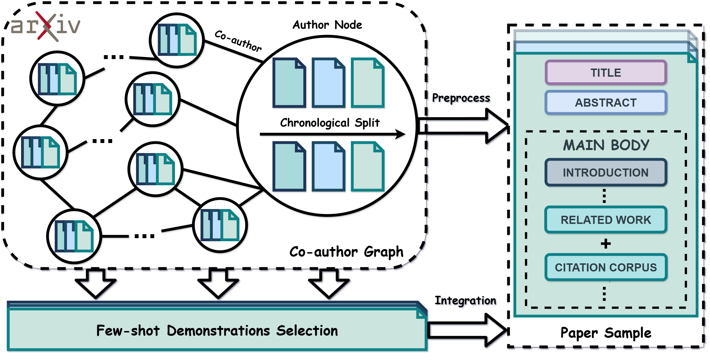

# AcademicEval: Live Long-Context LLM Benchmark


<p align="center">
    <a href="https://ulab-uiuc.github.io/AcademicEval/">
        
    </a>
    <a href="https://arxiv.org/abs/xxx">
        
    </a>
    <!-- <a href="xxx">
        
    </a> -->
    <a href="https://github.com/ulab-uiuc/AcademicEval/blob/master/LICENSE">
        
    </a>
    <br>
    <a href="https://github.com/ulab-uiuc/AcademicEval">
        
    </a>
    <a href="https://github.com/ulab-uiuc/AcademicEval">
        
    </a>
    <a href="https://github.com/ulab-uiuc/AcademicEval">
        
    </a>
</p>


<p align="center">
    <a href="https://ulab-uiuc.github.io/AcademicEval/">🌐 Project Page</a> |
    <a href="https://arxiv.org/abs/xxx">📜 arXiv</a>
    <!-- <a href="xxx">📮 Twitter Post</a> -->
<p>


<!-- <div align="center">
  
</div> -->


## News

**[2024.10.16]** 🌟 AcademicEval is released.


## Citation

```bibtex
@article{AcademicEval,
  title={AcademicEval: Live Long-Context LLM Benchmark},
  author={Haozhen Zhang and Tao Feng and Pengrui Han and Jiaxuan You},
  journal={arXiv preprint arXiv:xx},
  year={2024}
}
```


<!-- <picture>
<source media="(prefers-color-scheme: dark)" srcset="https://api.star-history.com/svg?repos=ulab-uiuc%2FAcademicEval&theme=dark&type=Date">

</picture> -->